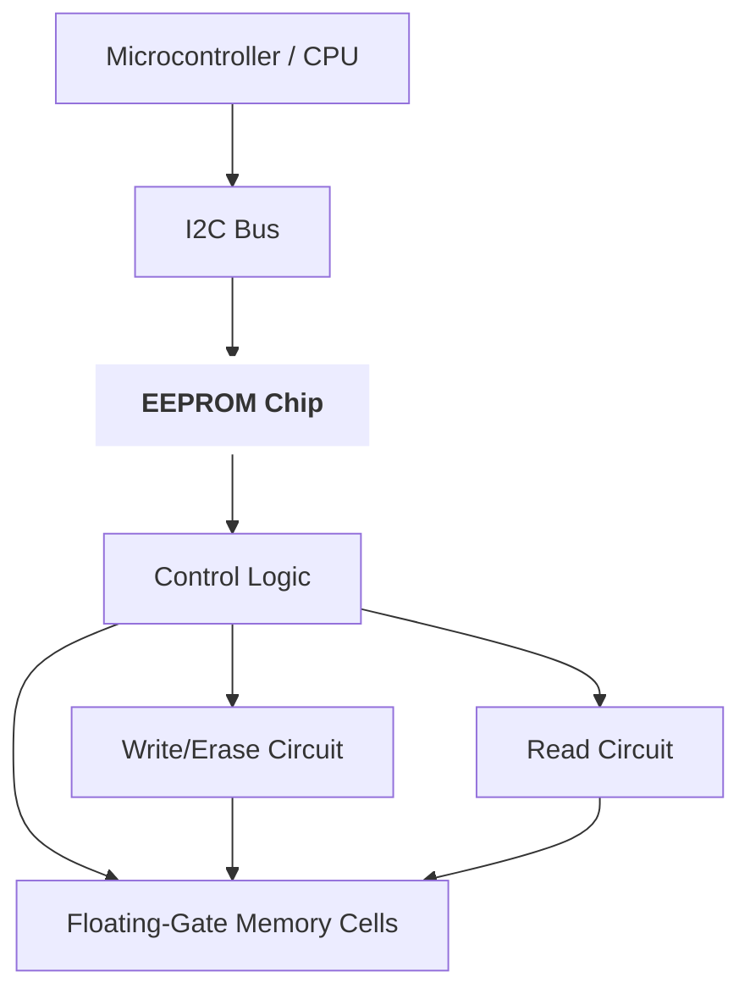

## 📌 EEPROM

**EEPROM** (Electrically Erasable Programmable Read-Only Memory, электрически стираемая программируемая постоянная память) — вид энергонезависимой памяти, позволяющей многократно записывать и стирать данные электрическими сигналами без необходимости физического извлечения микросхемы. EEPROM широко используется для хранения конфигурационных данных, калибровочных параметров, настроек и микропрограмм в различных электронных устройствах.

---

## 🧠 Как работает

### Основные принципы

- **Структура памяти:** EEPROM состоит из множества ячеек, каждая из которых хранит бит данных. Ячейки организованы в страницы и блоки.
- **Запись и стирание:** данные записываются и стираются электрическими импульсами, обычно блоками или страницами, при этом можно обновлять отдельные байты или страницы.
- **Сохранность данных:** данные сохраняются без питания, часто гарантируется срок хранения десятки лет.
- **Интерфейс доступа:** чаще всего EEPROM интегрирована с микроконтроллерами через последовательные интерфейсы — [[I2C]], [[SPI]], но бывают и параллельные версии.
- **Время доступа:** запись и стирание медленнее, чем чтение, запись обычно занимает миллисекунды.
- **Количество циклов перезаписи:** ограничено (от десятков тысяч до миллионов), что требует бережного использования.

### Аппаратное устройство ячейки

- EEPROM-ячейка построена на основе плавающего затвора (floating gate) транзистора, где электрический заряд хранит состояние.
- Электрическое стирание происходит за счёт туннелирования зарядов через изолятор.

### Блок-схема



### Интерфейс и управление

- Для обращения к EEPROM используют команды чтения, записи, стирания с указанием адреса.
- В микросхемах с интерфейсом [[I2C]] используется стандартный набор протоколов передачи.
- Контроллер EEPROM внутри микросхемы управляет процессом стирания/записи, обеспечивая надежность и защиту.

---

## ⚙️ Где применяется

- Хранение параметров конфигурации в [[MCU]], [[SoC]], бытовой и промышленной электронике.
- Микропрограммы, настройки, логи калибровки в датчиках и приборах.
- BIOS/UEFI микропрограммы на материнских платах (в меньшей степени, чаще используется Flash).
- Небольшие энергонезависимые базы данных в встраиваемых системах.
- Память для хранения критичных данных, требующих частого обновления.

---

## ✅ Преимущества

- **Энергонезависимость:** данные сохраняются без питания.
- **Возможность многократной перезаписи:** десятки тысяч циклов.
- **Удобство использования:** легко интегрируется с MCU через стандартные интерфейсы.
- **Гибкость записи:** можно изменять отдельные байты или страницы без стирания всего чипа.
- **Высокая надежность:** стабильность данных и высокая устойчивость к внешним воздействиям.

---

## ❌ Недостатки

- **Ограниченное число циклов перезаписи:** после исчерпания ресурса память может выйти из строя.
- **Медленное время записи и стирания:** в сравнении с RAM или Flash.
- **Низкая плотность памяти:** обычно объём меньше, чем у Flash и других энергонезависимых типов.
- **Высокая стоимость за бит:** по сравнению с Flash.
- **Часто ограниченный объём:** от нескольких килобайт до мегабайт, реже больше.

---

## 🔗 Связанные технологии

[[Flash]], [[EEPROM#I2C]], [[SPI]], [[NVRAM]], [[MCU]], [[SoC]], [[Non-volatile Memory]], [[Memory Controller]], [[ROM]], [[NAND]], [[NOR]], [[Memory Map]], [[EEPROM#Cell Structure]]

---

## Резюме

EEPROM — энергонезависимая память с возможностью электрического стирания и записи, широко применяемая для хранения конфигурационных и калибровочных данных в микроконтроллерах и встраиваемых системах. Несмотря на ограниченное число циклов записи и невысокую плотность, она остаётся востребованной благодаря гибкости, надежности и удобству интеграции.

---

### Примеры кода

#### C: чтение и запись EEPROM по I2C (микроконтроллер STM32)

```c
#include "i2c.h"

#define EEPROM_ADDR 0xA0 // 7-bit адрес сдвинутый

void EEPROM_WriteByte(uint16_t mem_addr, uint8_t data) {
    uint8_t buf[3];
    buf[0] = (mem_addr >> 8) & 0xFF; // старший байт адреса
    buf[1] = mem_addr & 0xFF;        // младший байт адреса
    buf[2] = data;
    HAL_I2C_Master_Transmit(&hi2c1, EEPROM_ADDR, buf, 3, HAL_MAX_DELAY);
    HAL_Delay(5); // задержка записи EEPROM (~5 мс)
}

uint8_t EEPROM_ReadByte(uint16_t mem_addr) {
    uint8_t data;
    uint8_t addr[2];
    addr[0] = (mem_addr >> 8) & 0xFF;
    addr[1] = mem_addr & 0xFF;
    HAL_I2C_Master_Transmit(&hi2c1, EEPROM_ADDR, addr, 2, HAL_MAX_DELAY);
    HAL_I2C_Master_Receive(&hi2c1, EEPROM_ADDR, &data, 1, HAL_MAX_DELAY);
    return data;
}
````

#### Python с использованием smbus (Raspberry Pi)

```python
import smbus
import time

bus = smbus.SMBus(1)
EEPROM_ADDR = 0x50

def eeprom_write_byte(addr, data):
    high = (addr >> 8) & 0xFF
    low = addr & 0xFF
    bus.write_i2c_block_data(EEPROM_ADDR, high, [low, data])
    time.sleep(0.01)  # задержка записи

def eeprom_read_byte(addr):
    high = (addr >> 8) & 0xFF
    low = addr & 0xFF
    bus.write_i2c_block_data(EEPROM_ADDR, high, [low])
    data = bus.read_byte(EEPROM_ADDR)
    return data
```

---

**Источники:**  
Microchip 24LCxx Datasheet, STMicroelectronics Application Notes, Wikipedia, osdev.org, habr.com, I2C and SPI protocol specs, Embedded Systems textbooks.