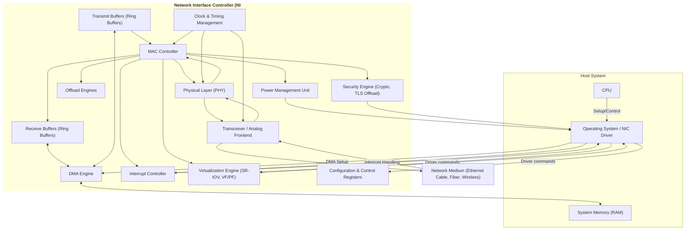

## 📌 NIC

**NIC** (Network Interface Controller, сетевой интерфейсный контроллер) — аппаратный компонент, обеспечивающий физическое и канальное взаимодействие компьютера или устройства с компьютерной сетью. NIC реализует функциональность передачи и приёма сетевых кадров, поддерживает низкоуровневые протоколы, управление доступом к среде передачи и взаимодействие с системным [[CPU]] и [[OS]]. Сегодня NIC выступают как отдельные устройства (сетевые карты) либо интегрированы в SoC, материнские платы и встраиваемые системы.

---

## 🧠 Как работает

### Основные функции NIC

- **Интерфейс с физической средой:** передача и приём электрических, оптических или радиосигналов через разъёмы (Ethernet RJ45, оптоволокно, Wi-Fi антенны и т.д.).
- **Формирование и анализ сетевых кадров:** упаковка данных в кадры согласно протоколу (Ethernet, Wi-Fi, Fibre Channel и др.).
- **Управление доступом к среде (MAC):** реализация протоколов доступа, обнаружение коллизий, управление скоростью.
- **Обработка адресации:** фильтрация кадров по MAC-адресам, поддержка мультикастов и широковещания.
- **Буферизация:** временное хранение пакетов для приёма и передачи, управление потоками.
- **Офгрузка обработки протоколов (Offloading):** TCP checksum, segmentation offload, VLAN tagging, шифрование.
- **Интерфейс с [[CPU]] и памятью:** DMA для обмена пакетами, прерывания для уведомлений.
- **Управление энергопотреблением:** поддержка Wake-on-LAN и режимов энергосбережения.
- **Поддержка виртуализации:** виртуальные функции (VF), SR-IOV, мультиплексирование каналов.

### Принцип работы NIC

1. **Приём данных:**  
   - Сигнал с физического уровня поступает в трансивер (PHY).  
   - PHY декодирует сигнал, выравнивает и формирует цифровые пакеты.  
   - MAC слой проверяет целостность, адресацию, фильтрует кадры.  
   - Приёмные буферы хранят кадры до передачи CPU.  
   - DMA контроллер перемещает данные в память системы.  
   - CPU уведомляется через прерывание.

2. **Передача данных:**  
   - CPU формирует данные в памяти и запускает DMA для передачи.  
   - DMA загружает кадры в буферы NIC.  
   - MAC формирует кадры, добавляет заголовки, контролирует доступ к среде.  
   - PHY преобразует цифровой сигнал в физический.  
   - Данные передаются в сеть.

### Взаимодействие с системой

- NIC подключается через интерфейсы: [[PCI]], [[PCIe]], [[USB]], [[M.2]], [[SATA]], [[SPI]], [[SDIO]].
- Для ускорения обмена используется **DMA** (Direct Memory Access), позволяющий NIC напрямую читать/писать системную память без участия CPU.
- Прерывания сообщают CPU о событиях: приём пакета, завершение передачи, ошибки.
- Современные NIC поддерживают offload-операции, снижая нагрузку CPU.
- Управление и конфигурация NIC производится драйверами и утилитами ОС.

---

### Базовая архитектурная блок-схема NIC

```mermaid
flowchart TB
    CPU["CPU / Host System"]
    DMA["DMA Controller"]
    SystemMem["System Memory (RAM)"]
    Driver["NIC Driver (OS)"]
    MAC["MAC Layer"]
    PHY["Physical Layer (PHY)"]
    Transceiver["Transceiver / PHY Analog"]
    Medium["Physical Medium (Ethernet, Fiber, Wireless)"]

    CPU -->|Настройка, управление| Driver
    Driver -->|Команды, конфигурация| MAC
    MAC --> PHY
    PHY --> Transceiver
    Transceiver --> Medium
    Medium --> Transceiver
    Transceiver --> PHY
    PHY --> MAC
    MAC --> Driver
    Driver --> CPU

    DMA --> SystemMem
    MAC <-->|DMA Data Transfer| SystemMem
````

---

### Расширенная архитектура NIC с ключевыми блоками

```mermaid
flowchart TB
    subgraph Host_System
        CPU["CPU"]
        SystemMem["System Memory (RAM)"]
        Driver["NIC Driver"]
        DMA["DMA Controller"]
    end

    subgraph NIC
        MAC["MAC Layer"]
        BufferRX["Receive Buffer"]
        BufferTX["Transmit Buffer"]
        Offload["Offload Engine"]
        InterruptCtrl["Interrupt Controller"]
        PHY["Physical Layer"]
        Transceiver["Transceiver (Analog Frontend)"]
        PowerMgmt["Power Management Unit"]
        VF["Virtual Function Controller"]
        Security["Security Engine (Crypto)"]
    end

    CPU --> Driver
    Driver --> MAC
    MAC --> PHY
    PHY --> Transceiver
    Transceiver --> Medium["Physical Medium"]

    Medium --> Transceiver
    Transceiver --> PHY
    PHY --> MAC

    MAC --> BufferRX
    BufferTX --> MAC
    BufferRX <-- DMA --> SystemMem
    SystemMem <-- DMA --> BufferTX

    MAC --> Offload
    Offload --> CPU
    MAC --> InterruptCtrl --> CPU
    MAC --> PowerMgmt
    MAC --> VF
    MAC --> Security

    Driver --> VF
```

---

## ⚙️ Где применяется

- В настольных и серверных компьютерах (Ethernet NIC).
    
- В мобильных устройствах (Wi-Fi, LTE, 5G модемы).
    
- В промышленных системах (SCADA, АСУТП).
    
- В встраиваемых системах и IoT (Ethernet, Wi-Fi, BLE).
    
- В дата-центрах и высокопроизводительных вычислительных системах с поддержкой RDMA, NVMe over Fabrics.
    
- В сетевых коммутаторах, маршрутизаторах, сетевых ускорителях.
    

---

## ✅ Преимущества NIC

- Высокая пропускная способность обмена данными.
    
- Аппаратное разгружение CPU благодаря DMA и offloading.
    
- Надёжное и стандартизированное подключение к сети.
    
- Поддержка множества протоколов и стандартов (Ethernet, Wi-Fi, Fibre Channel).
    
- Поддержка виртуализации и многофункциональных режимов.
    
- Расширяемость и адаптивность под разные среды и требования.
    
- Энергоэффективность с помощью продвинутого управления питанием.
    

---

## ❌ Недостатки NIC

- Сложность аппаратной реализации и программного обеспечения.
    
- Высокая стоимость для высокопроизводительных моделей.
    
- Возможные проблемы с совместимостью и драйверами.
    
- Повышенное энергопотребление при высокой нагрузке.
    
- Зависимость от качества физической среды (кабеля, помехи).
    
- Требования к грамотной настройке и безопасности.
    

---

## 🔗 Связанные технологии

[[Ethernet]], [[Wi-Fi]], [[PCIe]], [[DMA]], [[MAC]], [[PHY]], [[RDMA]], [[SR-IOV]], [[TCP/IP]], [[Offloading]], [[Interrupt]], [[Virtualization]], [[Fibre Channel]], [[SoC]], [[Switch]], [[Router]]

---

## Резюме

NIC — ключевой аппаратно-программный комплекс для сетевого взаимодействия, обеспечивающий надёжную, быструю и эффективную передачу данных между устройствами и сетями. Современные NIC обеспечивают высокопроизводительные функции offloading, виртуализацию, безопасность и энергосбережение. Глубокое понимание архитектуры NIC необходимо для оптимизации сетевых систем и разработки драйверов, а также для проектирования масштабируемых и надёжных сетевых решений.

---

## 🔄 Подробности по компонентам NIC

### 1. MAC Layer

- Отвечает за формирование кадров, добавление/проверку контрольных сумм (CRC).
    
- Управляет доступом к среде (CSMA/CD в Ethernet, CSMA/CA в Wi-Fi).
    
- Фильтрация адресов и управление приёмом.
    
- Поддержка VLAN, Jumbo frames, QoS.
    

### 2. PHY Layer

- Аналого-цифровое преобразование сигналов.
    
- Кодирование/декодирование физических уровней.
    
- Автоматическая настройка скорости и дуплекса.
    
- Поддержка различных стандартов (10/100/1000 Mbps, 10G, Wi-Fi).
    

### 3. DMA Engine

- Организация эффективного копирования данных.
    
- Минимизация нагрузки CPU.
    
- Поддержка Scatter-Gather и многоканальной передачи.
    

### 4. Buffers

- Приёмные и передающие очереди.
    
- Управление потоками и предотвращение потерь данных.
    
- Использование кольцевых буферов для циклической работы.
    

### 5. Offload Engines

- TCP/UDP checksum calculation.
    
- TCP segmentation offload (TSO).
    
- Large Receive Offload (LRO).
    
- VLAN tag insertion/removal.
    
- Шифрование и сжатие.
    

### 6. Interrupt Controller

- Генерация прерываний по событиям.
    
- Механизмы снижения количества прерываний (interrupt coalescing).
    

### 7. Virtualization Support

- SR-IOV (Single Root I/O Virtualization) — виртуальные функции.
    
- VF (Virtual Functions) и PF (Physical Functions).
    
- Управление доступом и разделением ресурсов между гостевыми ОС.
    

### 8. Power Management

- Поддержка Wake-on-LAN.
    
- Переключение режимов энергопотребления.
    
- Интеллектуальное управление частотами.
    

---

## 🔧 Программирование и драйверы

- Драйверы NIC реализуют взаимодействие с аппаратурой через регистры и DMA.
    
- Настройка фильтров, режимов работы, буферов.
    
- Обработка прерываний и событий.
    
- Интеграция с сетевыми стеками ОС (Linux, Windows).
    
- Поддержка протоколов и расширений (ethtool, netmap, DPDK).
    

---

## Большая блок-схема архитектуры NIC


