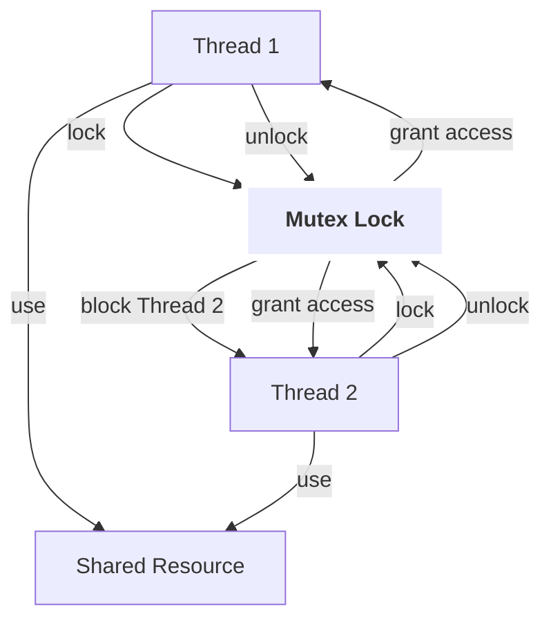

## 📌 Mutex

**Mutex** (Mutual Exclusion, мьютекс) — один из основных механизмов синхронизации в многопоточных системах, обеспечивающий взаимное исключение доступа к разделяемым ресурсам. Мьютекс гарантирует, что в каждый момент времени только один поток может владеть блокировкой и работать с критической секцией, предотвращая гонки данных и некорректное поведение.

---

## 🧠 Как работает

### Принцип действия

- Поток, желающий получить доступ к разделяемому ресурсу, вызывает операцию **lock()** мьютекса.
- Если мьютекс свободен — поток получает блокировку и продолжает работу.
- Если мьютекс уже захвачен другим потоком — вызывающий поток блокируется (спит), не потребляя CPU, ожидая освобождения.
- После завершения работы с ресурсом поток вызывает **unlock()**, освобождая мьютекс.
- Один из ожидающих потоков пробуждается и получает блокировку.

### Ключевые особенности

- **Блокировка и разблокировка:** атомарные операции, обычно реализуемые на уровне ОС с помощью системных вызовов.
- **Отсутствие busy-wait:** в отличие от спинлока, поток в состоянии ожидания мьютекса не потребляет CPU.
- **Планировщик ОС:** отвечает за постановку потока в очередь ожидания и пробуждение.
- **Возможность рекурсии:** некоторые реализации поддерживают рекурсивный мьютекс, когда один поток может многократно блокировать мьютекс.
- **Владение:** только поток, захвативший мьютекс, может его освободить.

---

### Псевдокод работы с мьютексом

```text
function mutex_lock(mutex):
    if mutex is free:
        mutex.owner = current_thread
    else:
        add current_thread to mutex.wait_queue
        block current_thread

function mutex_unlock(mutex):
    if mutex.wait_queue not empty:
        wake up one thread from wait_queue
        mutex.owner = that thread
    else:
        mutex.owner = none
````

---

## ⚙️ Где применяется

- В многопоточных и многопроцессорных приложениях.
    
- В ядрах операционных систем для защиты критических секций.
    
- В библиотеках параллелизма и многопоточности.
    
- В системах реального времени с поддержлением приоритетов.
    
- В клиент-серверных приложениях, базах данных, сетевых сервисах.
    

---

## ✅ Преимущества

- Минимальное потребление CPU при ожидании.
    
- Гарантия взаимного исключения и целостности данных.
    
- Поддержка приоритетов и справедливости (в некоторых реализациях).
    
- Рекурсивные версии для упрощения сложной логики.
    
- Поддержка таймаутов ожидания и прерываемости.
    

---

## ❌ Недостатки

- Переключение контекста при блокировке/разблокировке — накладные расходы.
    
- Возможность дедлоков при неправильном использовании.
    
- Приоритетное инверсирование — низкоприоритетный поток может блокировать высокоприоритетный.
    
- Более медленная реакция по сравнению со спинлоками при коротких критических секциях.
    
- Сложность реализации и отладки.
    

---

## 🔗 Связанные технологии

[[Spinlock]], [[Semaphore]], [[Futex]], [[Atomic Operation]], [[Condition Variable]], [[Thread]], [[Scheduler]], [[Deadlock]], [[Priority Inversion]], [[Lock-Free]], [[RTOS]], [[POSIX Threads]]

---

## Резюме

Mutex — ключевой механизм синхронизации для защиты критических секций, позволяющий потокам безопасно работать с разделяемыми ресурсами без гонок и повреждения данных. Он блокирует поток в случае занятости ресурса, освобождая CPU для других задач. Однако требует осторожности при проектировании, чтобы избежать дедлоков и приоритетной инверсии.

---

## 🧩 Блок-схема работы Mutex



---

### Примеры кода

#### C: простой mutex с использованием POSIX Threads (pthread)

```c
#include <pthread.h>
#include <stdio.h>

pthread_mutex_t mutex = PTHREAD_MUTEX_INITIALIZER;

void* thread_func(void* arg) {
    pthread_mutex_lock(&mutex);
    printf("Thread %ld acquired the mutex\n", (long)arg);
    // критическая секция
    pthread_mutex_unlock(&mutex);
    return NULL;
}

int main() {
    pthread_t t1, t2;
    pthread_create(&t1, NULL, thread_func, (void*)1);
    pthread_create(&t2, NULL, thread_func, (void*)2);
    pthread_join(t1, NULL);
    pthread_join(t2, NULL);
    return 0;
}
```

#### C++: std::mutex

```cpp
#include <mutex>
#include <thread>
#include <iostream>

std::mutex mtx;

void thread_func(int id) {
    mtx.lock();
    std::cout << "Thread " << id << " entered critical section\n";
    mtx.unlock();
}

int main() {
    std::thread t1(thread_func, 1);
    std::thread t2(thread_func, 2);
    t1.join();
    t2.join();
    return 0;
}
```

#### Linux Kernel: использование mutex

```c
struct mutex my_mutex;

mutex_init(&my_mutex);

void critical_section(void) {
    mutex_lock(&my_mutex);
    // критическая секция
    mutex_unlock(&my_mutex);
}
```

---

**Источники:**  
POSIX Threads documentation, C++ Standard Library, Linux Kernel Synchronization docs, "Operating Systems: Three Easy Pieces", Wikipedia, osdev.org.