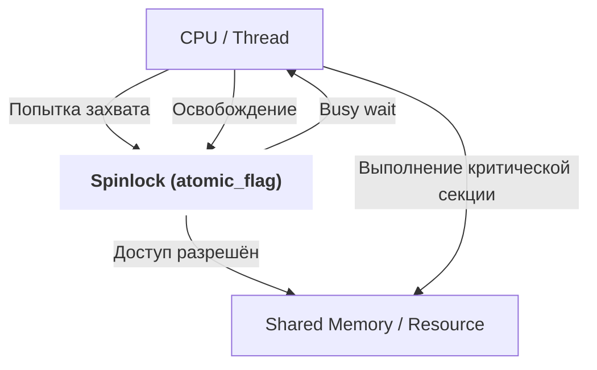

## 📌 Spinlock

**Spinlock** — простой механизм синхронизации, используемый в многопоточных и мультипроцессорных системах для защиты разделяемых ресурсов. При попытке захватить спинлок поток (или процессор) повторно проверяет доступность блокировки в цикле ожидания (spin), не переходя в состояние сна. Такой подход эффективен для коротких критических секций и в системах с высокой конкуренцией за ресурсы, где переключение контекста дорогостоящо.

---

## 🧠 Как работает

### Механизм работы

- **Попытка захвата:** поток пытается установить значение флага блокировки (например, atomic test-and-set или compare-and-swap).
- **Циклическое ожидание:** если блокировка занята, поток входит в цикл проверки, повторяя попытки захвата (спин).
- **Освобождение:** владелец блокировки снимает флаг, позволяя другим потокам захватить спинлок.
- **Преимущества:** нет расходов на переключение контекста, задержка минимальна при коротких критических секциях.
- **Недостатки:** потеря процессорного времени при длительном ожидании (busy-wait).

### Блок-схема



### Ключевые операции

- `lock(spinlock)` — попытка захватить блокировку, зацикливаясь, пока она не станет свободна.
- `unlock(spinlock)` — освобождение блокировки.
- **Atomic primitives** — тест и установка значения, важна атомарность для предотвращения гонок.

---

### Пример алгоритма (псевдокод)

```text
function lock(spinlock):
    while atomic_test_and_set(spinlock) == LOCKED:
        ; // активно ждем (spin)

function unlock(spinlock):
    atomic_clear(spinlock)
````

---

### Важные детали

- **Атомарность:** операции захвата и освобождения должны быть атомарными.
    
- **Преимущество для SMP:** хорошо работает на системах с несколькими процессорами.
    
- **Проблема приоритетов:** возможна проблема "голодания" (starvation).
    
- **Использование в ОС:** ядро Linux активно применяет спинлоки для синхронизации в SMP.
    
- **Управление кэшами:** современные реализации оптимизируют спинлок с помощью инструкций паузы (pause/yield), уменьшая нагрузку на кэш.
    

---

## ⚙️ Где применяется

- Синхронизация в ядре операционных систем.
    
- В системах реального времени с минимальной задержкой.
    
- Высокопроизводительные параллельные вычисления.
    
- Управление разделяемыми ресурсами в многопоточных приложениях.
    
- Встраиваемые и низкоуровневые системы с ограниченной поддержкой планировщика.
    

---

## ✅ Преимущества

- Минимальные накладные расходы при кратких критических секциях.
    
- Простота реализации.
    
- Хорошая производительность на SMP-системах.
    
- Не требует переключения контекста.
    
- Позволяет реализовать быстрые блокировки в ядре ОС.
    

---

## ❌ Недостатки

- Потеря процессорного времени при длительном ожидании.
    
- Неэффективен на однопроцессорных системах.
    
- Возможность "голодания" потоков.
    
- Высокое энергопотребление из-за активного ожидания.
    
- Требует осторожного использования для предотвращения дедлоков.
    

---

## 🔗 Связанные технологии

[[Mutex]], [[Semaphore]], [[Atomic Operation]], [[Lock-Free]], [[Barrier]], [[SMP]], [[Preemption]], [[RTOS]], [[Linux Kernel Synchronization]], [[Futex]]

---

## Резюме

Spinlock — базовый механизм блокировки с активным ожиданием, применяемый для защиты кратковременных критических секций в многопроцессорных системах. Обеспечивает низкие накладные расходы и простоту, но не подходит для длительного ожидания, поскольку блокирует процессор активным циклом. Ключевой элемент синхронизации в ядрах ОС и системах с высокой степенью параллелизма.

---

### Примеры кода

#### C: простой спинлок на atomic_flag (C11)

```c
#include <stdatomic.h>

typedef struct {
    atomic_flag flag;
} spinlock_t;

void spinlock_init(spinlock_t *lock) {
    atomic_flag_clear(&lock->flag);
}

void spinlock_lock(spinlock_t *lock) {
    while (atomic_flag_test_and_set_explicit(&lock->flag, memory_order_acquire)) {
        // active wait (spin)
    }
}

void spinlock_unlock(spinlock_t *lock) {
    atomic_flag_clear_explicit(&lock->flag, memory_order_release);
}
```

#### C++: использование std::atomic_flag

```cpp
#include <atomic>

class SpinLock {
    std::atomic_flag flag = ATOMIC_FLAG_INIT;
public:
    void lock() {
        while(flag.test_and_set(std::memory_order_acquire)) {
            // spin
        }
    }
    void unlock() {
        flag.clear(std::memory_order_release);
    }
};
```

#### Ассемблер x86: инструкция LOCK CMPXCHG для захвата спинлока

```assembly
spin_lock:
    mov eax, 0          ; ожидаемое значение (0 - свободно)
try_lock:
    mov ebx, 1          ; значение блокировки (1 - занято)
    lock cmpxchg [lock_var], ebx
    jne try_lock        ; если не удалось захватить — повторить
    ret
```

---

**Источники:**  
Linux Kernel Documentation, Intel x86 Architectures Manuals, C11 standard, C++11 std::atomic, OSDev.org, Wikipedia, "Operating Systems: Three Easy Pieces" by Remzi & Andrea Arpaci-Dusseau.